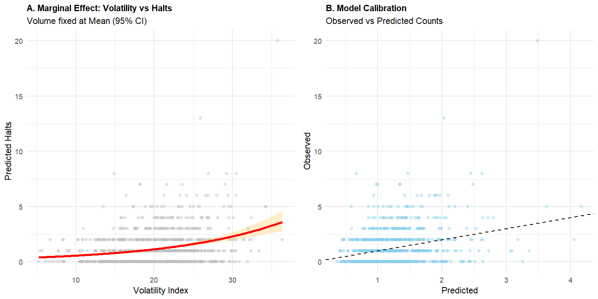

# NYSE Trading Halts Analysis: A Count Data Approach

## Project Overview
This project analyzes the drivers of trading halts on the NYSE using count data econometrics. The objective is to determine whether market volatility and volume linearly impact the frequency of operational interruptions and to select the most robust statistical framework for risk estimation.



## Key Findings
* **Overdispersion:** The data exhibited significant overdispersion ($Variance \gg Mean$), violating the equidispersion assumption of standard Poisson models.
* **Model Selection:** The **Negative Binomial model** provided a superior fit compared to Poisson (Significant AIC reduction), correctly capturing the "fat tails" of market stress events.
* **Stress Testing:** The model predicts a non-linear spike in trading halts during high-volatility regimes, providing a quantitative basis for operational risk capital allocation.

## Methodology
The analysis follows a rigorous statistical pipeline:
1.  **Data Simulation:** Generation of synthetic data mimicking NYSE microstructure properties (to preserve proprietary data privacy).
2.  **GLM Estimation:** Comparison of Poisson vs. Negative Binomial regression.
3.  **Validation:** Likelihood Ratio Tests, AIC/BIC comparison, and Dispersion Ratio analysis.
4.  **Visualization:** Marginal effect plotting with confidence intervals.

## Tech Stack
* **Language:** R (4.x)
* **Libraries:** `MASS` (GLM estimation), `ggplot2` (Visualization), `gridExtra`.

## How to Run
```r
source("nyse_halts_modeling.R")
